GUI for the Cone Ply Piece Optimization Tool
============================================

This tool is supposed to support the user by finding the optimal ply piece
shape for laminated cones. There are four different tools that can be used:

- The Input-Tool
- The Cone Geometry-Tool
- The Plot Ply Piece-Tool
- The Evaluation-Tool

When the program is started, the Input-Tool shows up. All other Tools are
accessible through the Menu Bar Item ‘Tools’.

Installation Requirements
-------------------------
To use this tool one needs Python (x,y) (full installation) and the
Add-on `Shapely <http://toblerity.org/shapely/index.html>`_.
All can be downloaded at http://code.google.com/p/pythonxy/ .

Input Tool
----------
The Input-Tool is also the Main Window of this program. The user can use the
other tools by following the program or by clicking the different items in
the menu ‘Tools’.

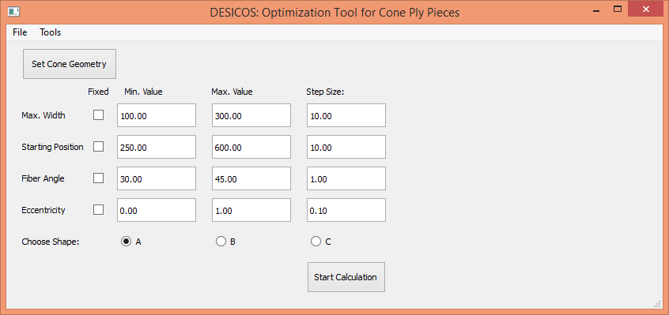

    Figure 1: Input GUI

In Figure 1 is the Input-Tool shown. In the menu bar are two different items
visible. In the ‘File’-Menu one can save or load a specific study or close
the whole program. Inside the ‘Tools’-Menu are three different items which
lead to the other three tools.

The ‘Set Cone Geometry’-Button opens the Cone Geometry-GUI, which will be
explained later.

One can edit five different parameters for one study: Maximum width, starting
Position, Fiber Angle, Width Variation and the basic ply shape. For each
parameter one has to define the lower and the upper limits and the step size.
On the right side of the GUI is a drawing which explains three of the four
numerical parameters. For further explanation is the effect of the parameters
in the following chapter shown.

Effect of the different parameters on the shape of the ply piece
................................................................

There are five different parameters used in this program to modify the
shape of the ply piece. The basic ply shape parameter changes the general
rules which are applied by constructing the ply piece. In Figure 2 is the
influence of the parameters shown. The blue lines are the edges of the
unwounded cone. The red and grey polygons are the ply pieces and the orange
area is the so called effective area. Inside this area the fiber angle
deviation is smaller than 2°. The larger the area, the better.

Shape A is a trapezoidal shape and has by definition none overlapping areas.
Only the sides perpendicular to the original line are parallel to each other.
Shape B is also a trapezoidal shape (called ‘Trapez2’) and allows single
overlapping of two ply pieces on the free cone area. The last basic shape
is rectangular. The opposite sides are parallel to each other.
In Figure 2 are the different basic shapes exemplarily shown.

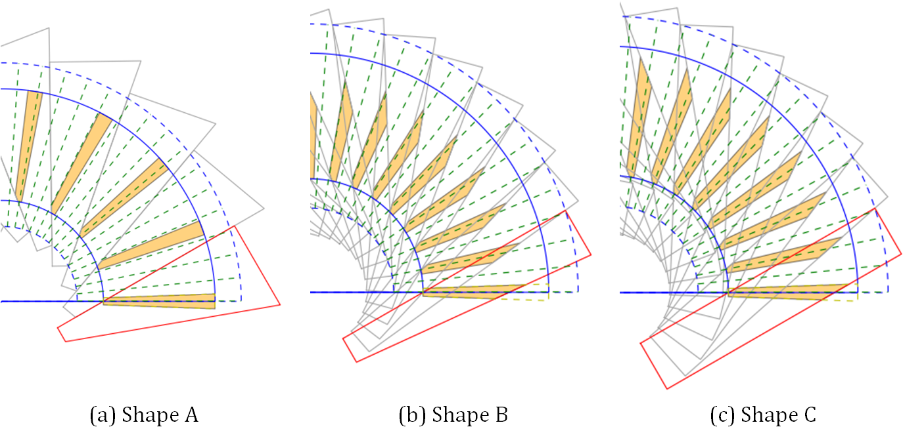

    Figure 2: Examples of different basic shapes

The maximum width parameter determines the largest width of the ply piece.
For the rectangular shape is the width constant and for the trapezoidal
shapes can this width be found at the lower end of the cone. In Figure 3
are three different examples for the maximum width shown.

.. figure:: ../../../../figures/modules/cppot/gui/fig_03.png
    :width: 700

    Figure 3: Example of the maximum width

The starting position `s_{{\Theta}_{nom}}` defines at which s-coordinate
the nominal fiber angle starts. The smaller the value is,
the nearer starts the part at the cone vertex. In Figure 4 are two
different examples shown.

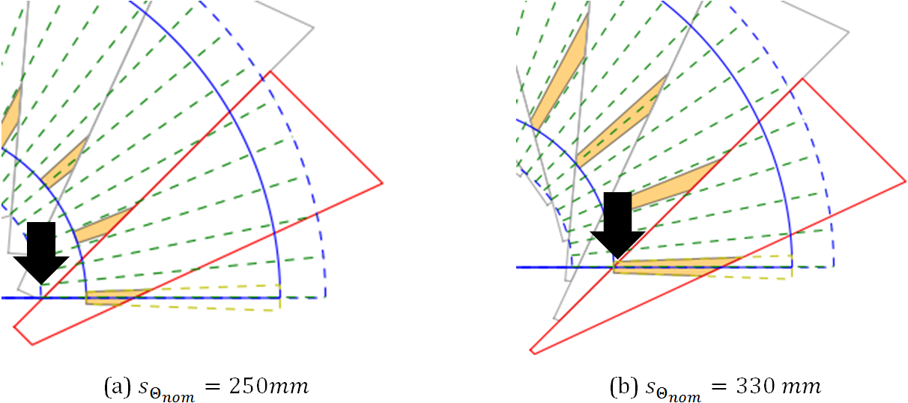

    Figure 4: Examples of the starting position

The fiber angle `{\Theta}_{nom}` is measured between the s-coordinate and
the straight lines of the ply piece. In this example the fiber angle lies
between the lower edge of the unwounded cone area and the upper and longer
edge of the ply piece. In Figure 5 are examples of different fiber angle
shown.

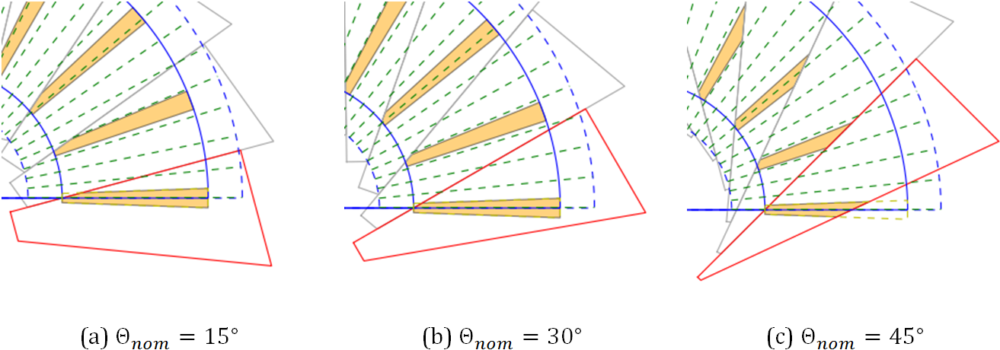

    Figure 5: Examples of different fiber angles

The width variation is a different parameter. When a ply piece is constructed,
the program uses a ‘basic line’ which starts at `s_{{\Theta}_{nom}}` with
the fiber angle `\Theta`. The ending edge of the ply piece is always
perpendicular to the basic line. The width variation defines the position
of the vertices of the ply piece polygon on the ending edge relative to
the basic line.

For a value of `a_w=0` the basic line is also the upper edge of the ply
piece polygon, see Figure 6 (a). When `a_w` is `0.5` the basic line is the
axis symmetry for the upper and lower ply piece edges (Figure 6 (b)).
The upper limit of `a_w` is `1.0` and then the basic line is also the lower
edge of the ply piece (Figure 6 (c)).

This parameter is important for fiber angles smaller than `15°`.
For larger angles the optimum is always `a_{w, opt}=0`. For `0°` the
optimum value is `a_w=0.5`. This variable can only be used for the Shapes A
and C.

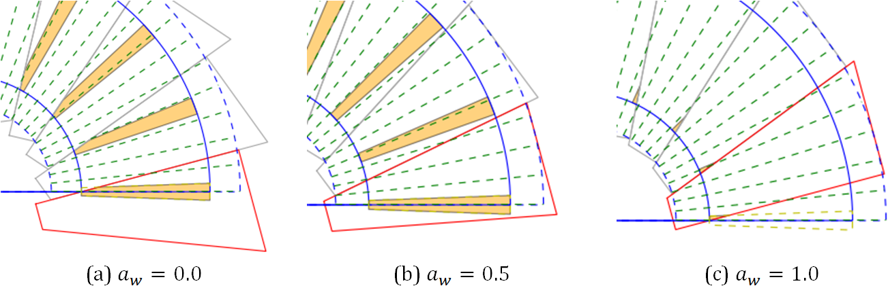

    Figure 6: Examples of different width variations

Using the Input-Tool
....................

The controls in the Input-Tool are used to define the limits and step sizes of
the parametric study.

In the first column one can choose if one of the parameters shall be fixed. In
this case only the minimum Value is considered. This reduces the processing
time and makes the evaluation easier.

The next three columns are the minimum, maximum and step size value for each
parameter. If an entry is invalid (Min > Max) a Message Box adverts the
mistake.

It is possible to save the parameters to a file and load it to the GUI later.
When loaded the values in the editable lines are changed.

It is not possible to compare the results of different basic shapes in this
tool. For this it is recommended to export the result data to Excel.

Geometry Tool
-------------
This tool changes the geometry of the studied cone. This tool can be entered
by clicking the ‘Set Cone Geometry’-Button or the ‘Cone Geometry Tool’- Item
in the Menu ‘Tools’ in the menu bar.

When started, the window in Figure 7 will be opened. On the left side are five
changeable lines and some further information about the cone geometry. It is
possible to change the the half-cone angle and the radii of the different cone
parts. The parts between `r1` and `r2` and between `r3` and `r4` are auxiliary
parts used for cutting and molding the edges of the cone. Between `r2` and
`r3` is the so called free cone area.

The algorithm of the ply piece design will try to cover the whole cone, but
the investigation and evaluation of the fiber angle deviation will be only
applied to the free cone.

On the right side of the window is a dynamic drawing, which will change with
the entered values. There is also the definition of the cone coordinate system
at the vertex.

On the right side of the Input lines are the maximum length and width of the
free cone and the length of both support areas. The length is measured in the
z-direction.

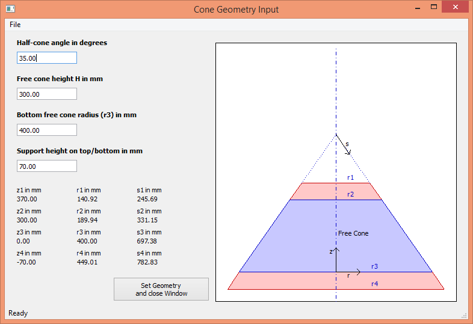

    Figure 7: Cone Geometry Tool

New cone designs can be saved to a file and in a later session recovered. The
save and load functions can be found in the File-Menu. The cone geometry set
in this window will be used for all tools of this program.

Evaluation Tool
---------------
The evaluation tool is used to draw graphics and export the results of a
parameter study to an Excel or csv-file. The tool will be opened after the
parametric study is finished or by clicking its Item in the Input-Tool Menu
‘Tools’. In Figure 8 is the Window of the evaluation tool shown.

The items for loading, saving and exporting can be found in the Menu ‘File’.
The loading application is used when the tool is opened directly from the
Input-Tool window. Only files created by the save-function can be loaded into
the program and not the export files.

To draw a graphic one has to choose witch results should be shown. It is
possible to show all evaluation parameters in one drawing. In the next step
one has to decide if the drawing should be a 2D or 3D Graphic. In a 2D-Graphic
is for every design parameter an own drawing made. At each Step are the
highest value and the value of the other parameters for this point shown. In a
3D-Graphic are also the best results for the two design parameters chosen as
axes shown. This drawing can be turned to get the best view of the drawing and
is useful to get an overview of the results. In Figure 9 and Figure 10 are
examples for the 2D and the 3D-Result drawing shown.

It is possible that the export function fails if there are too many results.
In this case one can simply save the results and afterwards import the file as
a csv-file to Excel.

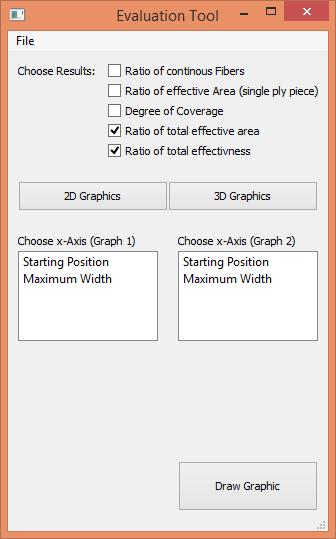

    Figure 8: Evaluation Tool

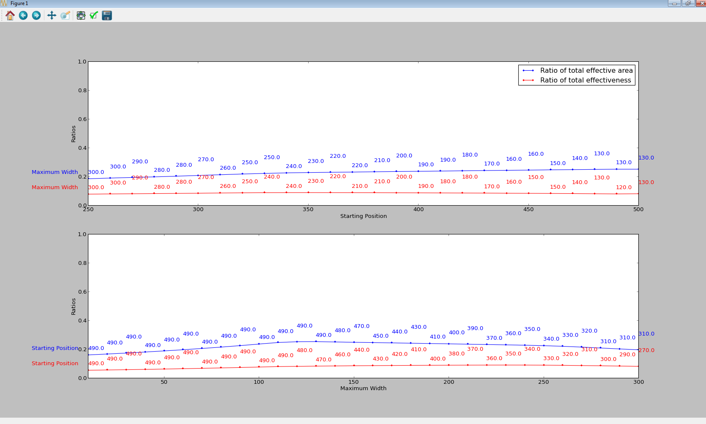

    Figure 9: 2D-Result Drawing

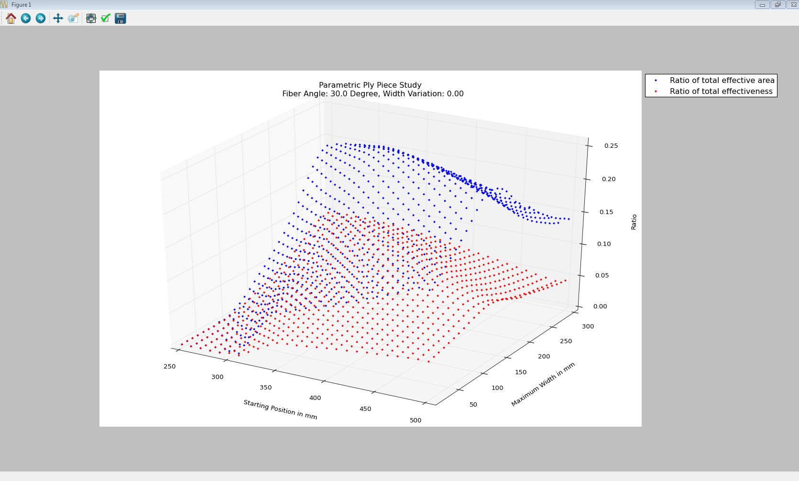

    Figure 10: 3D-Results Drawing

Evaluation Parameters
.....................

There are five different parameters used to evaluate the different shapes of
the ply pieces:

The degree of coverage `R_{DoC}` is the ratio of the area of a ply piece on
the free cone area `A_{piece}` times the number of pieces per ply `N_{pieces}`
and the free cone area `A_{cone}`:

.. math::
    R_{DoC}=\frac{A_{piece} \cdot N_{pieces}}{A_{cone}}

The optimal value is `100\%`. The value can be higher due to overlapping ply
pieces.

.. figure:: ../../../../figures/modules/cppot/gui/fig_11.png
    :width: 700

    Figure 11: Definition of the effective area

The effective area of a ply piece is the area in which the fibers have a fiber
deviation smaller than 2°. This area is used twice in evaluation
parameters: For the ratio of a single ply piece `R_{A_{eff}}` and for the
ratio for the whole cone `R_{\sum{A_{eff}}}`, called the ratio of total
effective area.

.. math::
    R_{A_{eff}}=\frac{A_{eff}}{A_{piece}}
    \\
    R_{\sum{A_{eff}}}=\frac{A_{eff} \cdot N_{pieces}}{A_{cone}}

In the drawings of the ‘Plot Ply Piece’-Tool is the effective area drawn as
orange polygons. The optimum value is also `100\%`, but is achievable only for
very small fiber angles.

When trapezoidal shapes are used, not all fibers starting at the bottom reach
the upper edge of the cone. The ratio of continuous fibers estimates the
amount of continuous fibers. Therefore are two lengths `l_{cont,1}` and
`l_{cont,2}` are defined and their ratio calculated:

.. math::
    R_{cont}=\frac{l_{cont,1}}{l_{cont,2}}

.. figure:: ../../../../figures/modules/cppot/gui/fig_12.png
    :width: 700

    Figure 12: Ratio of continuous fibers

For the rectangular shape this values should be always `100\%`.

The ratio of total effectiveness combines all ratios of the single ply pieces:

.. math::
    R_{total}=R_{DoC} \cdot R_{A_{eff}} \cdot R_{cont}

This ratio can be thought of the amount of free cone area covered with fibers
with a fiber deviation smaller than 2° and continuous from top to
bottom.  The optimum is `100\%`.

Plot Ply Piece - Tool
---------------------
This tool is useful to show the shape of a specific ply piece with specific
design parameters. In  is the Tool window shown. If the ‘Plot with/without
explanations’-box is set, the drawing contains further information about the
input parameters.

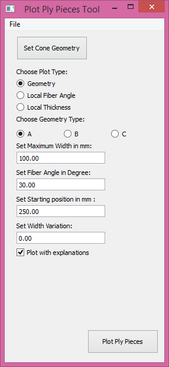

    Figure 13: Plot Ply Piece Tool

By clicking the ‘Plot Ply Pieces’-Button two new windows are opened, see
Figure 14. In the left side of the window is a table with the input
parameters, the lengths of each side, the evaluation parameters and further
information like the local fiber angles at the vertices of the free cone edges
and the ply piece.

On the right side are the ply pieces shown as grey and red polygons. The
effective area of each ply piece are drawn as orange polygons. The blue lines
are the outer edges of the cone geometry. The green radial lines are the lines
of the conical coordinate s. The radial angle difference between the lines is
`10°` in the conical coordinate system.

The image of the ply piece can be saved by clicking the save item in the menu
bar.

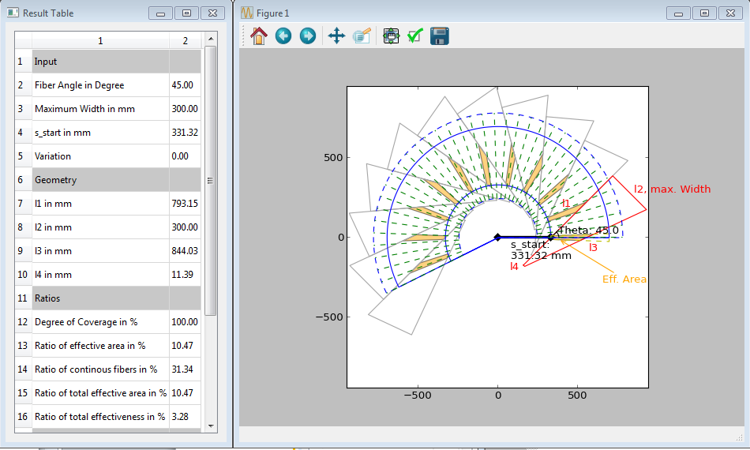

    Figure 14: Example of ply piece plot

Cutting Design - Tool
.....................
This tool calculates the ideal cutting design for two given boundaries of the
cone. This is necessary for tools with a finite length. As one can see in
Figure 14, the ply pieces are larger than the outer boundaries of the cone
(shown as blue dotted lines). If these were the boundaries of the conical
tooling, the manufacturing would be impossible or one would have to shorten
the ply pieces.  The cutting design tool uses the original design with the
same design parameters as the other tools and calculates the intersections of
the ply piece with the edges of the cone, see Figure 15.

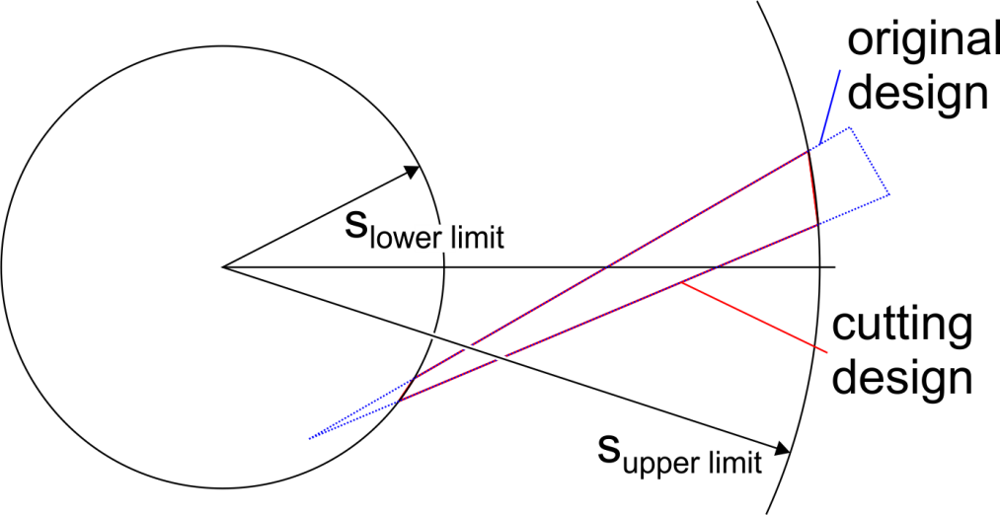

    Figure 15: Example of cutting design

The values of slower limit and supper limit are the s-coordinates of the used
edges. The cutting design is not only useful to make the ply pieces smaller
but also help to align the ply pieces properly. It is recommended to make
circumferential markings of the different radii / limit values and align the
ply pieces appropriately.

The tool itself is shown in Figure 16. In the upper part of the GUI are the
common controls for the design parameters and the cone geometry. In the last
two rows are the controls for the upper and lower limits of s. By clicking the
‘Calculate Cutting Shape’-Button two new windows are opened.

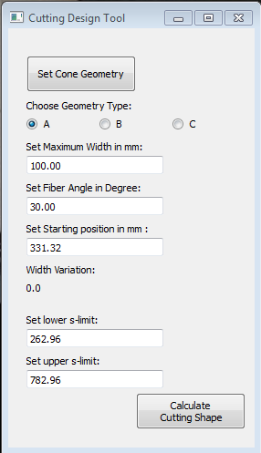

    Figure 16: Cutting Design Tool

The opened windows show the cutting design as a drawing and the corresponding
values of the four sides, see Figure 17. To simplify the transposing from this
tool to any drawing software, the lengths are given relatively to the fiber
orientation (x-axis).

.. figure:: ../../../../figures/modules/cppot/gui/fig_17.png
    :width: 700

    Figure 17: Cutting Design Window

Python Programming
------------------
This chapter gives a short introduction to the python files used in this
program and the basic ideas behind the programming.

Data Handling
.............

To handle the design and cone geometry parameters a python class called
‘DataHandle’ and the ‘ResultHandle’ for the results of the study. Both can be
fined in ``GUIHandle.py``.

The DataHandle has 10 variables and set/get-methods for each of them. Except
from the shape variable, all are arrays of integers or floats.

GUI Programming
...............

The tools are all programmed with
`PyQt4 <https://wiki.python.org/moin/PyQt4>`_. The following list connects
the python files and the GUI-Tools:

- Input-Tool: ``GUIInput.py``
- Cone Geometry Tool: ``GUIConeGeo.py``
- Evaluation Tool: ``GUIEval.py``
- Plot Ply Piece Tool: ``GUIPlot.py``
- Plot Ply Piece Tool: ``GUIDesign.py``

Backbone Programming
....................

In the following list are the Python files used to calculate the shapes and
draw the graphs:

- ``Bpart.py`` Collection of small functions to calculate coordinate
  transformations, intersections and evaluation parameters
- ``Bproto.py`` Contains the algorithms for the basic shapes: Trapez (Shape
  A), Trapez2 (Shape B), Rect (Shape C). The functions only return the
  vertices of the prototype shape., which will be later rotated around the
  cone vertex.
- ``GUICalc.py`` Contains the class used to make all variations of the study.
  Is called by Input-Tool, calls afterwards the evaluation tool and shows a
  progress bar.
- ``GUIPrint.py`` Contains the functions and classes used to draw the evaluation
  graphs. Uses matplotlib.
