Virtual Material Model (VMM)
============================

Introduction
------------

The basic problem with laminated cones is the change of the local fiber angle
due to the plane ply parts and the curved cone surface. Because of the curved
surface the fibers are lying on the geodesic path, see Figure 1. There are two
different fiber angles `\Theta_{s1}` and `\Theta_{s2}` at the positions `s_1`
and `s_2`. The variable s is part of the conical coordinate system. Goldfeld
[goldfeld2007]_ describes the local fiber angle `\Theta` as a function of s:

.. math::
    \Theta(s)=arcsin \left( \frac{s_1}{s} \cdot sin(\Theta_1) \right)

This approach is only valid for the path of a single fiber. A new approach is
to describe the local fiber angle by the difference between the angle of the
point of interest and the angle of the starting point of the ply part:

.. math::
    \Theta(\phi)= \Theta_1-(\phi-\phi_1)

This approach can be used for ply parts with a finite width and is the key
formula for this program.

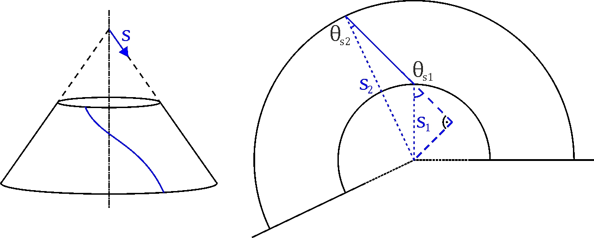

    Figure 1: Path of Fiber on Cone

The objective of this tool is to calculate the local fiber angle and thickness
of any given point on a laminated cone. To do this the laminate will be
rebuilt as a virtual model. Each ply (i) consists of a finite number of pieces
(j) with a certain ply angle `\Theta_i` and offset angle `\phi_{i,j}`. These
are called ply pieces. After building the model, another algorithm determines
in which ply piece(s) a given point lies and calculates the local fiber angles
and thickness.

This manual is supposed to explain the VMM. The corresponding code is located
in :mod:`desicos.cppot.core`. This material model is used by both the
Abaqus-plugin (:class:`desicos.abaqus.imperfections.ppi.PPI`)
and in the separate Cone Ply Piece Optimization Tool (CPPOT).

Coordinate systems
------------------

This program works with several different coordinate systems:

* **3D-Cartesian**: Used for the model generation in ABAQUS

.. math::
    x,y,z \in [-\infty, +\infty]

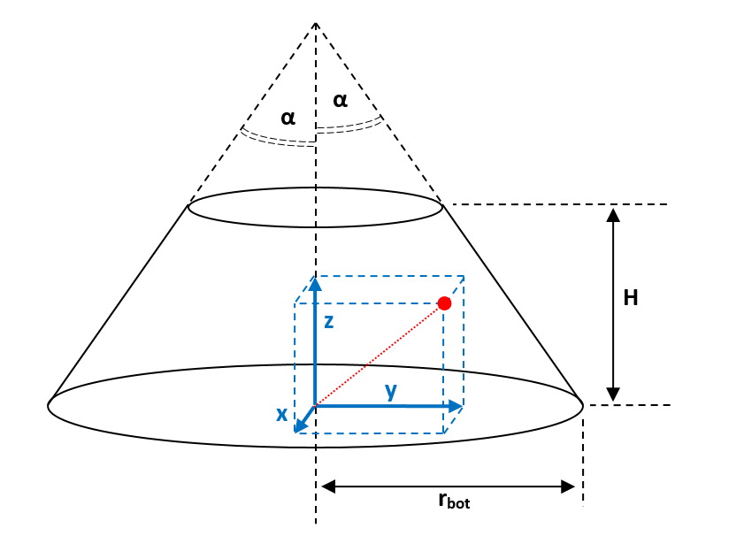

    Figure 2: Global 3D-Cartesian coordinate system

* **3D-cylindrical**: This often allows considerable simplification in
  axisymmetric cases, such as cones. Note that the symbol `\psi` is used here
  for the circumferential coordinate instead of `\theta`, because the latter
  will be used for the fiber angle.

.. math::
    r &\in [0, +\infty] \\
    \psi &\in [0, 2\pi) \\
    z &\in [-\infty, +\infty]

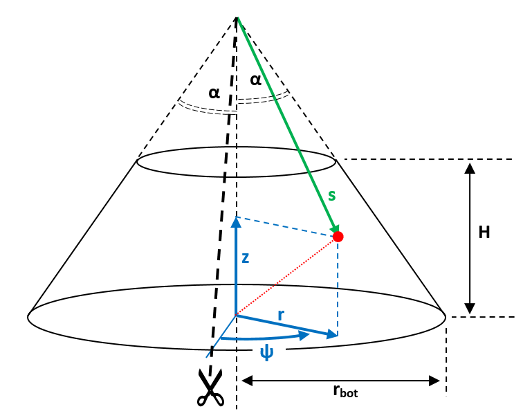

    Figure 3: Global 3D-cylindrical coordinate system

The coordinate transformation between Cartesian and cylindrical coordinates
and vice versa is done as follows:

.. math::
    (x, y, z) &= (r\cos\psi, r\sin\psi, z) \\
    (r, \psi, z) &= (\sqrt{x^2 + y^2}, {\rm atan2}{(y, x)}, z)

**Unfolded coordinates**

The cone surface is a two-dimensional surface within the three-dimensional
space. Points on the cone have to satisfy the following equation:

.. math::
    r = r_{bot} - z \tan\alpha

Points that satisfy this equation can be described using a two-dimensional
coordinate system. For this purpose, an imaginary cut is made through the cone
at `\psi = 0`, see the above figure. The apex of the cone is placed at the
origin of the new coordinate system. The edge in the direction `\psi > 0`
(right edge in the figure) is mapped to the horizontal axis. This results
in the layout shown below:

.. figure:: ../../../../figures/modules/cppot/vmmt/fig_unfolded_csys.png
    :width: 700
    :align: center

    Figure 4: Unfolded coordinate systems (polar and Cartesian)

These unfolded coordinates can be described using two coordinate systems:

* **2D-polar**: This is the most natural description:

.. math::
    s &\in [0, +\infty] \\
    \phi &\in [0, \phi_{max})

The relation between the 2D-polar coordinates `(s, \phi)` and 3D-cylindrical
coordinates is as follows, valid only for points on the cone surface:

.. math::
    (s, \phi) &= \left(\frac{r}{\sin\alpha}, \psi\sin\alpha\right) \\
    (r, \psi, z) &= \left(s\sin\alpha, \frac{\phi}{\sin\alpha},
    \frac{r_{bot}}{\tan\alpha} - s\cos\alpha\right)

Using the above coordinate transformation, the maximum value for the
`\phi`-coordinate (labeled `phi_{max}`) can be calculated, as well as the
radial limits `s_{bot}` and `s_{top}`:

.. math::
    \phi_{max} &= 2\pi\sin\alpha \\
    s_{bot} &= \frac{r_{bot}}{\sin\alpha} \\
    s_{top} &= \frac{s_{top}}{\sin\alpha} =
    \frac{r_{bot} - H\tan\alpha}{\sin\alpha} =
    \frac{r_{bot}}{\sin\alpha} - \frac{H}{\cos\alpha}

* **2D-Cartesian**: Used for geometrical operations on the unfolded cone
  (defining lines, calculating intersection points, ...):

.. math::
    \eta, \zeta \in [-\infty,+\infty]

The transformation rules are fairly straightforward:

.. math::
    (\eta, \zeta) &= (s\cos\phi, s\sin\phi) \\
    (s, \phi) &= \left(\sqrt{\eta^2 + \zeta^2},
    {\rm atan2}{(\zeta, \eta)}\right)

* **Laminate coordinates** To describe the orientation of fibers and plies,
  a laminate coordinate system is used in Abaqus, as is shown in the figure
  below. This is a local coordinate system that defines three directions at
  each point on the cone. The 1-direction is obtained by projecting the
  z-axis onto the cone surface, i.e. it is always pointing towards the
  apex of the cone. The n-direction is normal to the surface and always
  pointing outward. The 2-direction is obtained by rotating the 1-direction
  `90^\circ` around the normal vector, using the right-hand rule. The angle
  `\theta` is used to define the orientation of a fiber or ply. It is defined
  as being 0 for fibers parallel to the 1-direction and increases when
  rotating from the 1- to 2-direction, as shown in the figure.

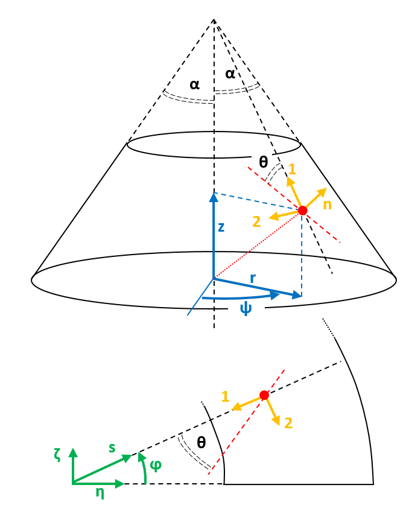

    Figure 5: Laminate coordinate system, shown relative to both global (top)
    and unfolded (bottom) coordinates.

Detailed cone geometry
----------------------
The cone geometry used in the DESICOS project is slightly more complex than the
elementary truncated cone discussed in the previous chapter. Apart from the
free cone area, additional support parts are present along both edges, as shown
in the figure below. The support areas will be partially cut away (to obtain
straight, clean edges) after laminating and the rest will be molded in resin.
These areas do need to be considered when discussing the ply placement process,
however.

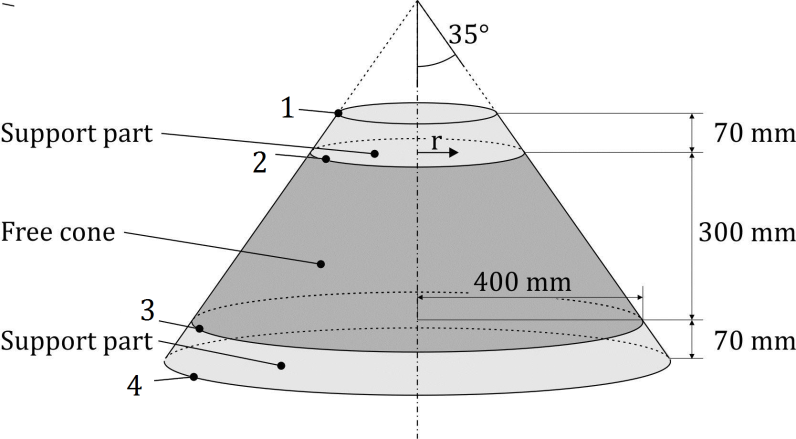

    Figure 6: Example of cone geometry.

Translating this geometry to the unfolded cone results in the figure below.
There are four relevant radii, labelled s1 to s4. These correspond to the edges
numbered 1 to 4 in figure 6. The total area between the dotted arcs (s1 and s4)
will need to be covered with ply pieces. However, only the area between the
solid arcs (s2 and s3) will be relevant when determining the local fiber
orientation at a later stage.

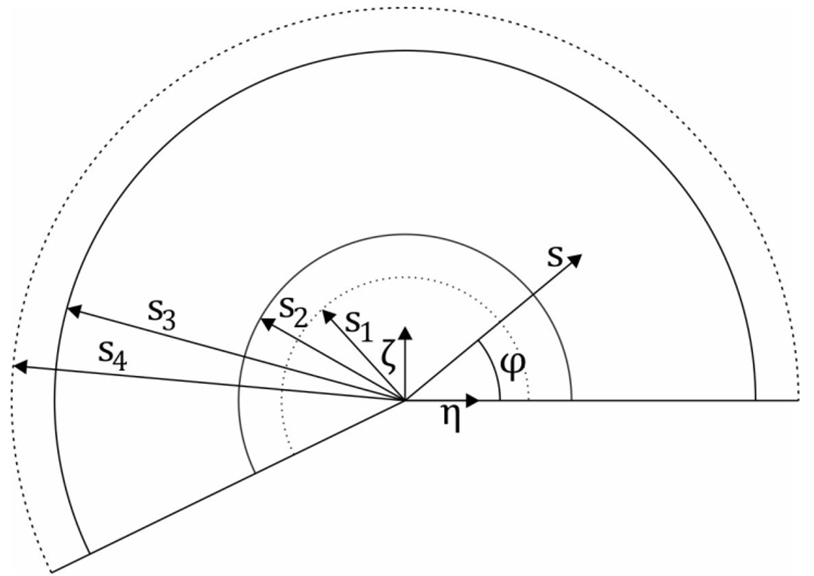

    Figure 7: Radii used in unfolded cone.

In the code, the geometry of the cone is encapsulated in the
:class:`desicos.cppot.core.geom.ConeGeometry` class. This class is constructed
based on a few input parameters, listed below. All other parameters
(``s1`` .. ``s4``, ``rtop``, ...) are then easily retrieved upon request.

    * The bottom radius of the free cone `r_{bot}` (400 mm in figure 6)
    * The semi-vertex angle `\alpha` (`35^\circ` in figure 6)
    * The free cone height `H` (300 mm in figure 6)
    * The support height ``extra_height`` (70 mm in figure 6)

Building the Ply model
----------------------

The VMM is the virtual model of the lay-up of the laminated cone. Every ply
consists of a finite number of pieces. Between the parts are no gaps, depending
on the ply piece geometry there may be overlaps. In the Abaqus-plugin only one
type of ply piece is available:

* Type A: Trapezoidal ply pieces without overlaps

Two additional shapes are accessible through the CPPOT-program:

* Type B: Trapezoidal ply pieces with one overlap
* Type C: Rectangular ply pieces with many overlaps.

In this document, only shape A will be discussed, because it is the only one
that has actually been used in the manufacturing of cones.

The basic process flow for building the model for a single ply is:

- (1) Construct a prototype piece
- (2) Copy and rotate the prototype piece to fill the entire cone
- (3) Calculate the local fiber orientation at the desired points

The three numbered steps will now be discussed sequentially:

1. Constructing the prototype piece
-----------------------------------

The construction of a single ply piece will now be described step-by-step.
Objective is mainly to describe the procedure, not to bother the reader with
implementation details (e.g. "How to find the intersection of two lines?"). For
the latter, consult the relevant pieces of code. The implementation of the
procedure described here is contained in the method
:func:`desicos.cppot.core.ply_model.TrapezPlyPieceModel.construct_single_ply_piece`.

The constructed ply pieces will be trapezoidal in shape, as shown in the
figure below. These trapezoidal pieces will be constructed such the angle that
is spanned or “covered” by each ply piece is a constant `\Delta\phi`,
independent of `s`. This property is important to allow covering the entire
cone with similarly-shaped pieces, without having gaps or overlaps.

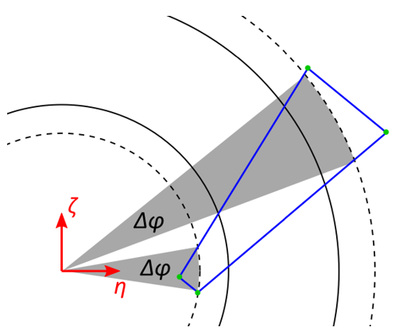

    Figure 8: View of single ply piece

**Step 1: Origin line `L_0`**

The first step is to construct the *origin line* `L_0`. All fibers in the ply
piece will be parallel to this line. It is defined based on three parameters:

* The nominal fiber angle `\theta_{nom}`, which is the same for all ply pieces
  in a ply.
* The nominal ply piece angle `\phi_{nom}`. Note that this is a property of the
  individual ply piece, not a property of the ply.
* The starting position `s_{\theta nom}`, which is the radius at which
  (at the nominal ply piece angle `\phi_{nom}`) the actual fiber angle equals
  the nominal fiber angle.

The line `L_0` is then defined as the line going through the point
`(s, \phi) = (s_{\theta nom}, \phi_{nom})` at an angle
(`\theta_{nom} + \phi_{nom}`) with respect to the `\eta`-axis. See figure 9:

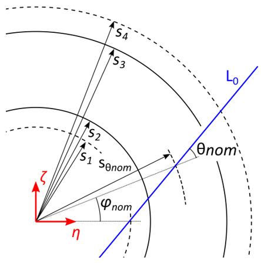

    Figure 9: Construction of origin line `L_0`

**Step 2: Base line `L_2`**

The *base line* `L_2` is the line along which the width of the ply piece will
be measured. `L_2` is defined as the line perpendicular to `L_0` and tangent to
the circle with radius `s_4`. Point `P_0` is then defined as the intersection
point of `L_0` and `L_2`. See Figure 10:

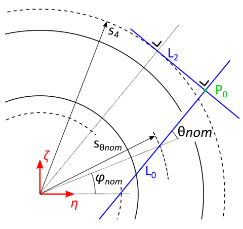

    Figure 10: Construction of base line `L_2`

**Step 3:  Corners at outer edge**

The outer edge of the polygon is formed by the line `L_2`. The position of the
corner points `P_2` and `P_3` along this line is determined by two parameters:

* The maximum ply piece width `w_{max}` is equal to the distance between the
  two points `P_2` and `P_3`.
* The *eccentricity parameter* `a_{ecc}` (also known as *width variation*)
  determines the placement of the two points relative to `P_0`. `a_{ecc}` is
  defined as the distance from `P_0` to `P_2`, divided by `w_{max}`. So for
  `a_{ecc} = 0`, `P_2` and `P_0` coincide and for `a_{ecc} = 1`, `P_3` and
  `P_0` coincide.

This is also shown in figure 11. So `P_2` is defined as the point on `L_2` at a
distance (`a_{ecc}\cdot w_{max}`) from `L_0`, while `P_3` is defined as the
point on `L_2` at a distance (`(1 - a_{ecc})\cdot w_{max}`) from `L_0`.
For completeness, it should be mentioned that `P_2` is to be placed in the
counter-clockwise direction relative to `P_0` and `P_3` in the clockwise
direction relative to `L_0`, as is evident in the figure below.

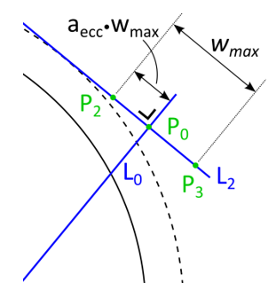

    Figure 11: Construction of `P_2` and `P_3`

**Step 4:  Calculating the spanned angle**

Now it is necessary to calculate the angle `\Delta\phi` that is spanned by the
ply piece. This angle is determined by the position of points `P_2` and `P_3`.
However, it would be wrong to take the angular coordinates of `P_2` and `P_3`
and subtract them (`\Delta\phi \neq \phi_{P2} - \phi_{P3}`), because the radii
`s_{P2}` and `s_{P3}` of these points are not the same.

Therefore, the points `T_2` and `T_3` are constructed first. Point `T_i` is
defined as the point lying on `L_0` at a distance `s_{Pi}` from the origin.
Now the two constituent parts of `\Delta\phi` can be calculated. One part is
the difference in angular coordinate between `P_2` and `T_2`, the other between
`T_3` and `P_3`. This is shown more clearly in figure 12 below.

.. math::
    \Delta\phi_1 &= \phi_{P2} - \phi_{T2} \\
    \Delta\phi_2 &= \phi_{T3} - \phi_{P3} \\
    \Delta\phi &= \Delta\phi_1 + \Delta\phi_2

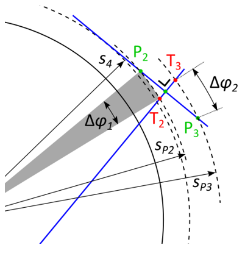

    Figure 12: Angle `\Delta\phi` spanned by ply piece

**Step 5:  Constructing the side lines**

Now the side lines `L_1` and `L_3` can be constructed by rotating `L_0` around
the origin. `L_1` is constructed by rotating `L_0` counter-clockwise with angle
`\Delta\phi_1`, `L_3` is constructed by rotating `L_0` clockwise around angle
`\Delta\phi_2` .The intersection point between `L_1` and circle `s_1` is
denoted as `P_{1a}`, the intersection point between `L_3` and circle `s_1` is
denoted as `P_{4a}`. All of this is shown in figure 13:

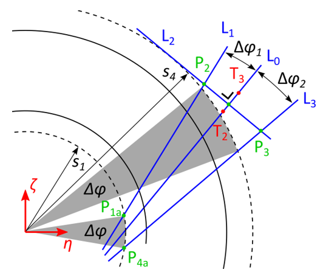

    Figure 13: Constructing the side lines `L_1` and `L_3`

**Step 6:  Corners at the inner edge**

Now the inner edge of the polygon is to be defined. First, it is examined which
point is further from `L_2`, either `P_{1a}` or `P_{4a}`. See figure 14, in
the shown example case the point `P_{4a}` is the furthest from `L_2`. The line
`L_4` is then defined to be parallel to `L_2` and through this furthest point.
Then points `P_{1b}` and `P_{4b}` are defined as the intersection points of `L_4` with,
respectively, `L_1` and `L_3`.

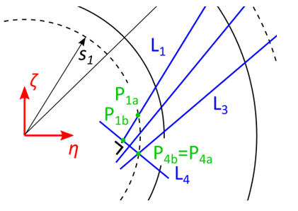

    Figure 14: Constructing `L_4`

There is a special case, which is shown in figure 15. Namely, for some
combinations of parameters, the previous procedure may lead to polygons
(`P_{1b}`, `P_{2}`, `P_{3}`, `P_{4b}`) that are self-intersecting. In this
case, both `P_1` and `P_4` are defined to be equal to the intersection point of
`L_1` and `L_3` and the ply piece becomes a triangle. This results in some very
small areas along circle `s_1` being not covered with any ply piece. This is
deemed acceptable, because the area between `s_1` and `s_2` is not relevant for
the finite element model.

In the normal case of figure 14, where the polygon is not self-intersecting,
the final locations of `P_1` and `P_4` are equal to `P_{1b}` and `P_{4b}`,
respectively.

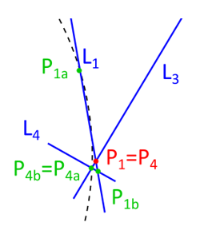

    Figure 15: Special case for triangular ply piece

**Step 7: Final ply piece**

The final shape of the ply piece is shown in figure 16 below. Its shape is
defined by the four corner points `P_i (i = 1...4)`. On the circle with radius
`s_{\theta nom}` (the starting position), the ply piece spans an angle from
`\phi_{nom, min}` to `\phi_{nom, max}`. These angles can be calculated by:

.. math::
    \phi_{nom, min} &= \phi_{nom} - \Delta\phi_2 \\
    \phi_{nom, max} &= \phi_{nom} + \Delta\phi_1

Additionally, the *limit angles* of the ply piece are defined as the minimal
and maximum value of the angular coordinate. Since the extreme values are
always located at the corner points, these can be calculated by:

.. math::
    \phi_{limit, min} &= \min_i(\phi_{Pi}) \\
    \phi_{limit, max} &= \max_i(\phi_{Pi})

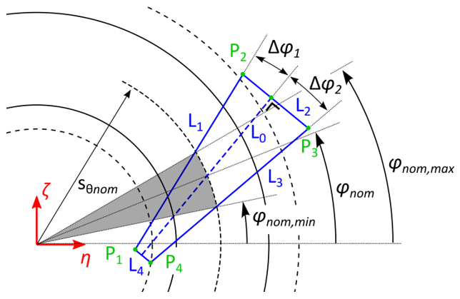

    Figure 16: Final ply piece

2. Constructing all ply pieces
------------------------------

Based on the prototype ply piece discussed in the previous section, the
complete set of ply pieces can be constructed. In the code, this is implemented
mainly in the method
:func:`desicos.cppot.core.ply_model.PlyPieceModel.rebuild`.

First the required number of ply pieces is determined:

.. math::
    n_{pieces} = \frac{\phi_{max}}{\Delta\phi}

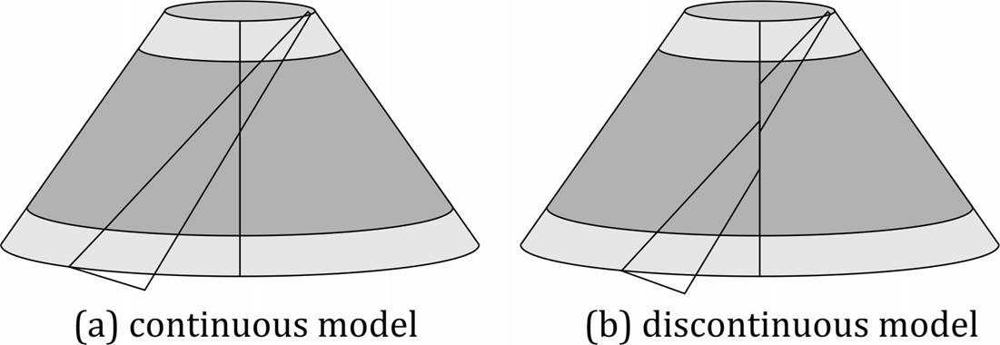

    Figure 17: Continuity problem

Generally, `n_{pieces}` is not an integer, so covering the entire cone with
similar pieces would result in a discontinuous model, as shown in figure 17.
To remedy this problem, a smaller *rest* piece is added. This rest piece should
span an angle: (with `\lfloor x\rfloor` denoting the floor function)

.. math::
    \Delta\phi_{rest} &= \phi_{max} - \lfloor n_{pieces}\rfloor\Delta\phi \\
    &= n_{pieces}\Delta\phi - \lfloor n_{pieces}\rfloor\Delta\phi \\
    &= \left(n_{pieces} - \lfloor n_{pieces}\rfloor\right)\Delta\phi \\
    &= f_{rest}\Delta\phi

with

.. math::
    f_{rest} = \frac{\Delta\phi_{rest}}{\Delta\phi}
    = n_{pieces} - \lfloor n_{pieces} \rfloor

So in words, `f_{rest}` is the fractional part of `n_{pieces}`. To construct
the rest piece, the same procedure is followed as for a normal ply piece.
However, during step 4, the calculated values of `\Delta\phi_1` and
`\Delta\phi_2` are multiplied by `f_{rest}` as stated below. This results in
a ply piece whose angular span `\Delta\phi_{rest}` satisfies the above
equations. The positions of points `P_2` and `P_3` (and, of course, the
calculations in subsequent steps) are adjusted accordingly.

.. math::
    \Delta\phi_{rest,1} &= f_{rest}\Delta\phi_1 \\
    \Delta\phi_{rest,2} &= f_{rest}\Delta\phi_2 \\
    \Delta\phi_{rest} &= \Delta\phi_{rest,1} + \Delta\phi_{rest,2}
    = f_{rest}\Delta\phi

Now the procedure to cover the entire cone with ply pieces is as follows. The
first piece is placed at a nominal angle `\phi_{nom}` equal to `\phi_{offset}`.
This is done to allow offsettnig multiple plies with the same nominal fiber
orientation with respect to each other. This avoids that the ply piece
edges in multiple plies coincide, which would (unnecessarily) cause weak spots
in the actual cone. The offset parameter is specified in relative terms
(0...1), based on this value `\phi_{offset}` is calculated as follows:

.. math::
    \phi_{offset} = f_{rel,offset}\Delta\phi \\
    {\rm with}\qquad f_{rel,offset} \in [0, 1)

Ply pieces are then placed in both directions at angular increments of
`\pm\Delta\phi`. Pieces are added as long as they cover some area in the
angular range `[0, \phi_{max}]`, which is the case if both below-stated
inequalities are satisfied.

.. math::
    \phi_{limit,min} &\leq \phi_{max} \\
    \phi_{limit,max} &\geq 0

The possible result of this operation is shown in figure 18. Here the unfolded
cone is drawn in red, the first ply piece in blue, the other ply pieces in
green and the nominal angle of each ply piece as a dashed black line. The rest
piece is inserted right after (in counter-clockwise direction) the first piece
for which `\phi_{limit,min} > 0`. This prevents the rest piece from overlapping
the “cut” in the model, which would add additional complexity to the model.
Some special handling is needed to set the angular offsets between the rest
piece and its neighboring pieces. If the nominal angles of the rest piece,
the previous piece and the next piece are named `\phi_{nom,rest}`,
`\phi_{nom,prev}` and `\phi_{nom,next}`, respectively, their mutual relations
are as stated below. Refer also to the figure.

.. math::
    \phi_{nom,rest} - \phi_{nom,prev} &= \Delta\phi_1 + \Delta\phi_{rest,2} \\
    \phi_{nom,next} - \phi_{nom,rest} &= \Delta\phi_{1,rest} + \Delta\phi_2

.. figure:: ../../../../figures/modules/cppot/vmmt/fig_all_pieces.png
    :width: 700
    :align: center

    Figure 18: Covering the cone

Note that the model contains a few more ply pieces than the actual cone,
because the pieces that intersect the cut (`\phi = 0` and `\phi = \phi_{max}`)
are represented twice. This is done because it simplifies the implementation,
while not affecting the results in any way.

3. Calculating the local orientation
------------------------------------

To calculate what the local fiber angle is at any point on the cone, several
steps are needed.

**Step 1:  Change coordinate system**

First, the coordinates in the global coordinate system have to be transformed
to the coordinates of the unfolded cone, i.e. `(\eta, \zeta)` and/or
`(s, \phi)`. These coordinate transformations have been discussed in a
previous chapter on this page and will not be repeated.

**Step 2:  Find the correct ply piece**

Next, it is necessary to find the ply piece(s) located at the given
coordinates. This is done by iterating over all ply pieces and then,for each
ply piece:

* Quickly check whether `\phi_{limit,min} \leq \phi \leq \phi_{limit,max}`.
  If not, continue.
* Perform the (computationally more expensive) test whether the point is inside
  the polygon that defines this ply piece. In earlier versions the
  “interior angle”-algorithm was used, but for performance reasons this was
  changed to the “ray casting”-algorithm. Both algorithms are widely used and
  extensively documented in other sources. If this check returns a positive
  result, stop iteration and return this ply piece. If not, continue.
* If iteration completes without having found a ply piece, the point is not on
  the cone at all and ``NaN`` is returned.

**Step 3:  Find the local angle**
A relation for the local fiber angle can be found, based on the principle that
the sum of all angles inside a triangle is always equal to `180^\circ`. This
results in the following equation:

.. math::
    \theta_{local} = \theta_{nom} - (\phi - \phi_{nom})

An example plot of the local fiber angle is shown in the figure below. Note
that all points within the same ply piece have a constant fiber angle along
radial lines (`\phi = {\rm const}`) and that there are significant
discontinuities between adjacent plies.

.. figure:: ../../../../figures/modules/cppot/vmmt/fig_orientation.png
    :width: 750
    :align: center

    Figure 18: Example of local fiber orientation throughout the cone
